<div align="center">

# Wave

**A lightweight, cross-platform, offline-first music player.**

Local library, real audio DSP, synced lyrics, and an opt-in tier of free online
catalogs — in a single portable app built on Rust + Tauri + React.

[](https://github.com/BMDarkLight/Wave/actions/workflows/build.yml)
[](https://github.com/BMDarkLight/Wave/actions/workflows/android.yml)
[](https://github.com/BMDarkLight/Wave/actions/workflows/rust.yml)
[](https://github.com/BMDarkLight/Wave/actions/workflows/frontend.yml)
[](LICENSE)

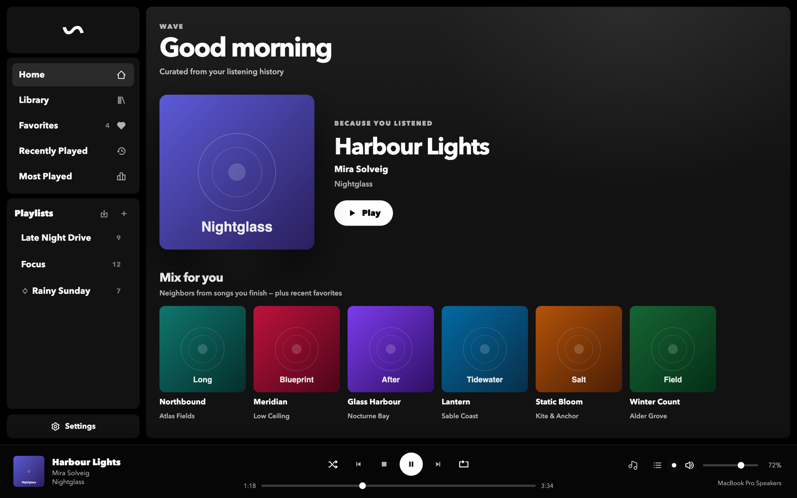

</div>

---

## Table of contents

- [Installation](#installation)
- [Highlights](#highlights)
- [Features](#features)
  - [Home & discovery](#home--discovery)
  - [Library, albums & artists](#library-albums--artists)
  - [Metadata editor](#metadata-editor)
  - [Three-tier search](#three-tier-search)
  - [Queue & playback](#queue--playback)
  - [Lyrics](#lyrics)
  - [Audio engine & DSP](#audio-engine--dsp)
  - [Playlists, favorites & folder sync](#playlists-favorites--folder-sync)
  - [Listening stats](#listening-stats)
  - [Desktop & OS integration](#desktop--os-integration)
  - [Command line](#command-line)
- [Android](#android)
- [Command line interface](#command-line-interface)
  - [Library](#library)
  - [Playlists and favorites](#playlists-and-favorites)
  - [Playback](#playback)
  - [Tags and cover art](#tags-and-cover-art)
  - [Equalizer and playback settings](#equalizer-and-playback-settings)
  - [Stats](#stats)
  - [Terminal output](#terminal-output)
  - [Scripting and automation](#scripting-and-automation)
- [Screens](#screens)
- [Tech stack](#tech-stack)
- [Project structure](#project-structure)
- [Getting started](#getting-started)
- [Design goals](#design-goals)
- [License](#license)

---

## Installation

Wave installs as a normal desktop app and puts a `wave` command on your `PATH`.

| Platform    | Install                                                         |
| ----------- | --------------------------------------------------------------- |
| Debian/Ubuntu | `sudo apt install ./Wave_0.5.0_amd64.deb`                      |
| Fedora/RHEL | `sudo dnf install ./Wave-0.5.0-1.x86_64.rpm`                     |
| Arch        | `yay -S wave-music-player-bin`                                   |
| Flatpak     | `flatpak install app.bmdarklight.wave`                           |
| AppImage    | download, `chmod +x`, run                                        |
| macOS       | `brew install --cask wave`, or the `.dmg`                        |
| Windows     | `winget install BMDarkLight.Wave`, `choco install wave`, or the installer |

Grab the packages from the [latest release](https://github.com/BMDarkLight/Wave/releases).

See **[docs/INSTALL.md](docs/INSTALL.md)** for per-platform details, how the
`wave` command gets onto `PATH` on each system, and where the packaging sources
live.

---

## Highlights

| | |
|---|---|
| 🎧 **Offline-first** | Your library is local files plus a SQLite index. No account, no server, no telemetry. |
| ⚡ **Native audio** | Rodio + Symphonia + CPAL on desktop, Media3 ExoPlayer on Android. No web audio stack. |
| 🔍 **Three-tier search** | Filters the current view, then the whole library (lyrics included), then — only if you ask — the internet. |
| 🎚️ **Real DSP** | 10-band biquad equalizer, crossfade, gapless playback, and loudness normalization. |
| 📝 **Synced lyrics** | Auto-fetched from LRCLIB, highlighted line by line, importable and exportable. |
| 🌐 **Free catalogs** | Stream or download full-length tracks from Internet Archive and Jamendo. Off by default. |
| 📱 **One codebase** | Windows, macOS, Linux, and Android — desktop and touch layouts from the same UI. |
| 🪶 **Portable** | A single native binary; no Electron, no heavy runtime. |

---

## Features

### Home & discovery

The home screen is built from your own listening history — a featured track based
on what you last played, a "Mix for you" row of neighbors from songs you finish,
album shelves, and suggested artists similar to the ones you actually listen to.


### Library, albums & artists

Point Wave at a folder and it scans, extracts tags, embeds cover art, and indexes
everything into SQLite. The library view is virtualized, sortable, and resizable,
with inline favorite toggles and a right-click menu for **Play Next**, **Add to
Queue**, **Add to Playlist**, **Edit Metadata**, **Go to Album**, and **Go to
Artist**.

Supported formats: `aac`, `aiff`, `alac`, `caf`, `flac`, `m4a`, `m4b`, `m4p`,
`mka`, `mkv`, `mp1`, `mp2`, `mp3`, `mp4`, `oga`, `ogg`, `opus`, `wav`, `wave`,
`weba`.

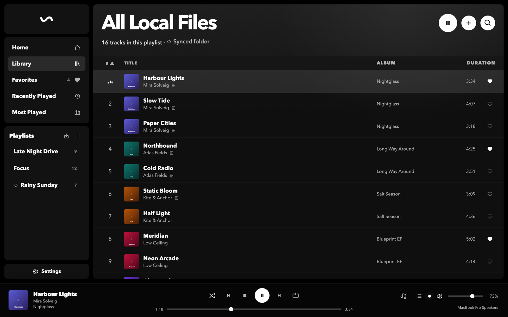

Album and artist pages are generated from your tags — full-resolution cover,
tracklist, and a per-artist discography you can jump into from any track.

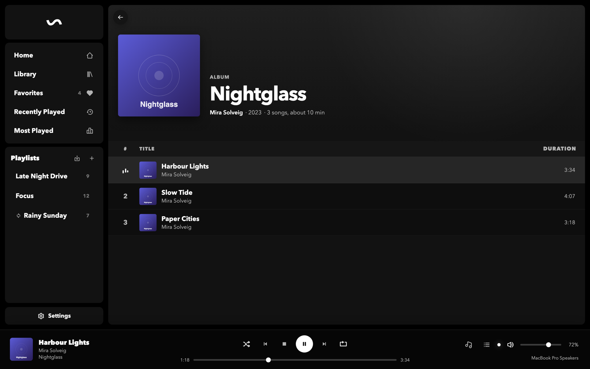

### Metadata editor

Right-click any track, or use the **…** button on its row, and pick **Edit
Metadata** to fix title, artist, album, album artist, genre, year, track and
disc number, or to replace the cover art from an image file. Changes are
written into the audio file itself, not just into Wave's database, so they
survive a re-scan and other players see them too.

The track menu sits on every list Wave shows: the library, album and artist
pages, search results, and the played-tracks views. On narrow windows and on
touch the **…** button stays visible, since there is no right mouse button to
fall back on.

Albums get the same editor for every track at once, from **Edit metadata** on
the album page. Fields the tracks disagree on start blank and are left alone
unless you fill them in, so setting a year across an album never flattens
eleven different titles into one. Cover art picked there is re-encoded to a
bounded JPEG before it goes into each file.

An empty field clears the tag. Title, artist and album are the exceptions:
Wave falls back to the filename for those, so they always keep a value.

The editor works on Android too. Tracks there come from the folder picker as
documents rather than plain files, so Wave copies one into its cache, writes
the tags, and copies it back. If you granted the folder read-only access when
you added it, the editor says so and offers to add it again, which is enough to
upgrade the permission.

30-second previews aren't files Wave can rewrite, so the option doesn't appear
for them.

### Three-tier search

Search widens only as far as it has to, and never touches the network on its own:

1. **Current view** — instant filter over whatever list you are looking at.
2. **Your library** — realtime SQLite search across title, artist, album,
   filename, **and lyrics**, with badges showing which field matched and a
   snippet of the matching lyric line.
3. **The internet** — an explicit button, never automatic. Off entirely unless
   you enable **Search outside sources** in Settings.

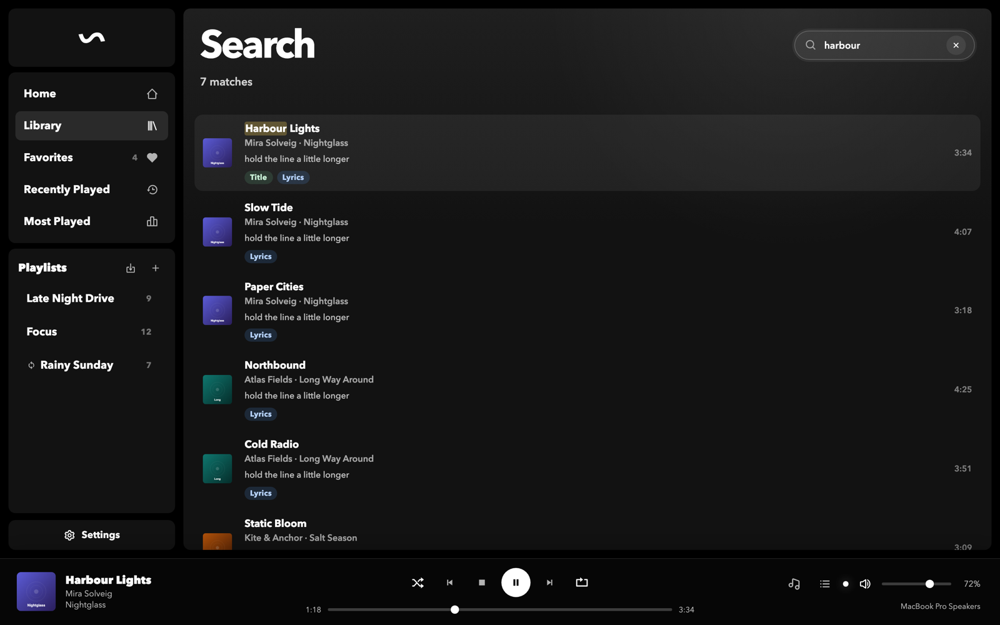

Tier 3 queries Internet Archive, Jamendo, and Deezer concurrently and groups the
results by provider with their licence line. Full-length audio can be streamed or
saved to your library; Deezer only exposes 30-second previews, so those play but
are never written to disk. A provider that fails degrades to an "unavailable"
section instead of breaking the search.

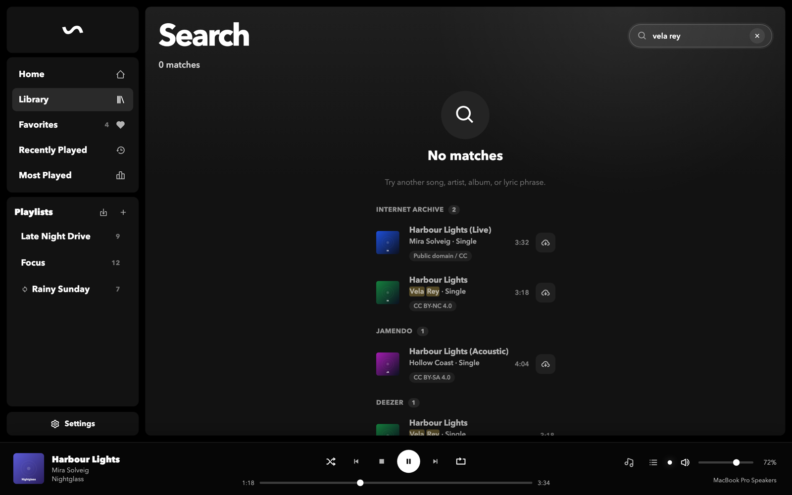

### Queue & playback

An in-memory queue independent of your playlists: reorder by drag, remove
individual entries, queue a track next, shuffle, and repeat off / one / all.
Previous rewinds the current track if you are more than three seconds in.

A **sleep timer** pauses playback after 15 to 90 minutes, or when the current
track ends. The volume eases down over the last ten seconds, and resuming
picks up where it stopped. Set it in the volume and equalizer panel on
desktop, from the moon button on the Android Now Playing screen, from the tray
menu, or with `wave playback sleep`.

**Playback speed** runs from 0.5x to 2x without changing pitch. It lasts
until Wave closes, so the next launch always starts at normal speed. Set it in
the volume and equalizer panel on desktop, in the Now Playing sheet on
Android, or with `wave playback speed`.

The **seek bar is the track's waveform**: the part already played is lit, and
you can click or drag anywhere on it to jump there. While a track plays, the
bars around the playhead rise and fall with the music. A track is analysed
the first time it plays, and the shape is saved in the library so it shows
straight away after that. Streams and previews keep a plain slider. On
Android the waveform sits on the Now Playing screen; the mini player keeps its
thin bar. Turn off **Waveform seek bar** in Settings for a plain slider, which
also stops Wave from analysing tracks for it.

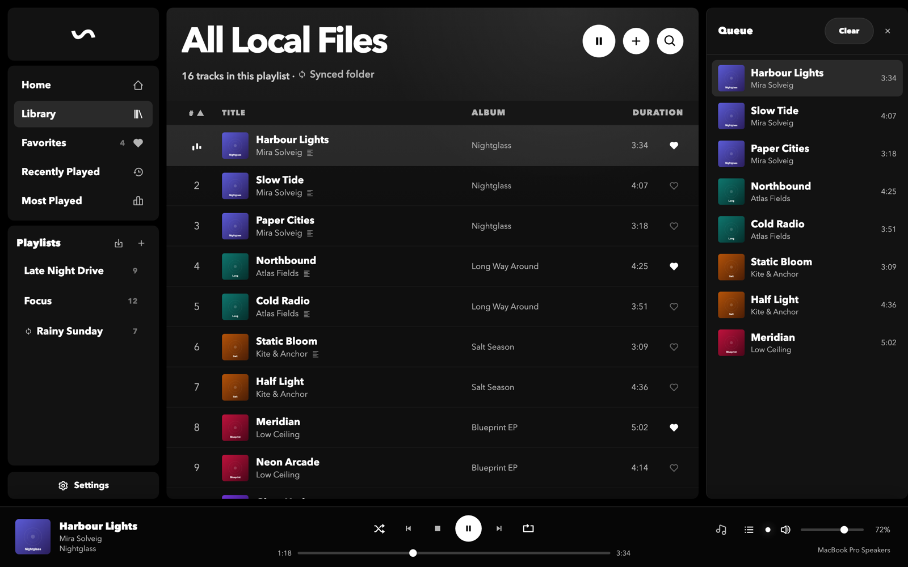

### Lyrics

Lyrics are fetched automatically from [LRCLIB](https://lrclib.net) when a song
starts (toggleable), stored with the track, and highlighted line by line in sync
with playback. You can also import your own `.lrc` files, export everything as a
backup, and restore a lyrics backup into matching library tracks later.

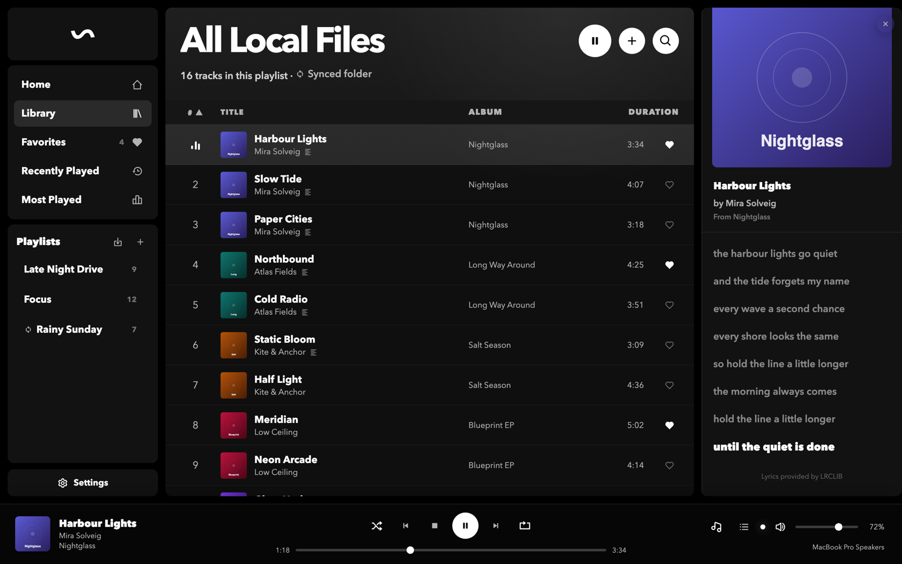

### Audio engine & DSP

- **10-band graphic equalizer** (31 Hz – 16 kHz) built from real biquad peaking
  filters, with presets and ±12 dB per band, applied live without a gap.
- **Crossfade** up to 8 seconds between tracks.
- **Gapless playback** for continuous albums.
- **Volume normalization** that pulls quiet and loud tracks toward the median
  loudness of your queue without clipping.
- **Audio output device switching** at runtime.

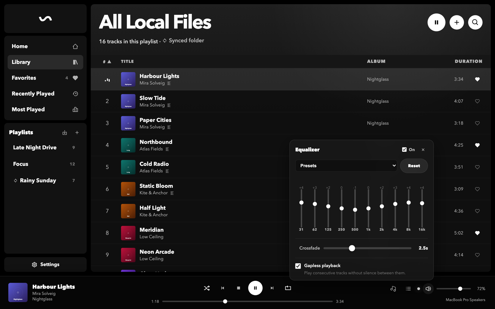

### Playlists, favorites & folder sync

Create, rename, delete, import, and export playlists (`m3u` and `json`).
**Favorites** and **All Local Files** are permanent seeded playlists. Any playlist
can be *linked to a folder* — Wave then re-scans that folder on demand and keeps
the playlist in step with what is actually on disk.

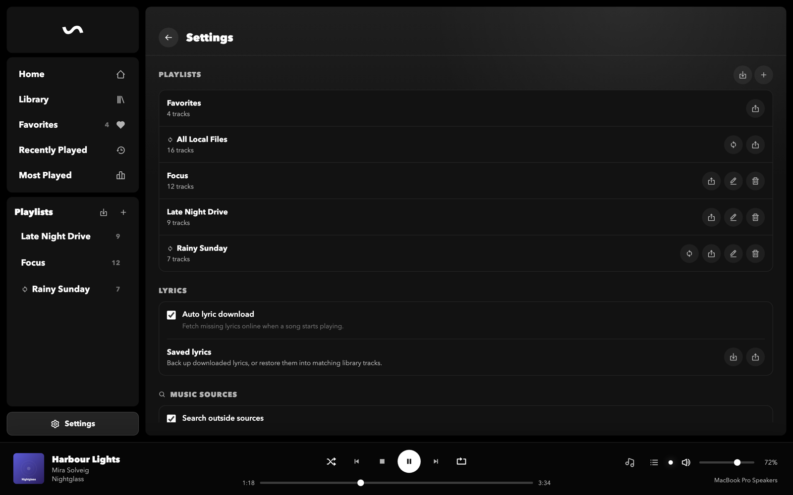

### Listening stats

Total listening time, play counts, and ranked top songs, artists, albums, and
genres — computed locally from your own playback history.

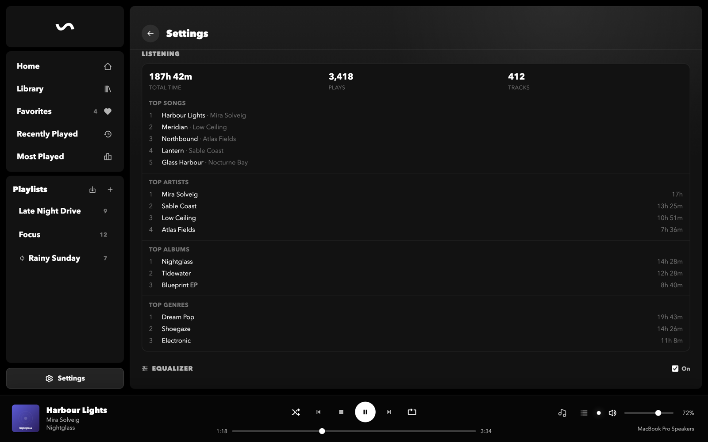

### Desktop & OS integration

- **System tray / menu bar** icon with transport controls and a playlist submenu.
- **OS media controls** — the platform's own now-playing widget, media keys, and
  lock-screen artwork stay in sync.
- **Close-to-tray** — choose whether the close button quits Wave or hides it.
- **Single instance** — a second launch hands off to the running app instead of
  starting a competing audio engine.

### Command line

The same binary runs headless, with everything the app can do: the library,
playlists, playback with a live dashboard, tags, the equalizer, and listening
stats. Its JSON output, event stream, and batch input make it a dependable
backend for scripts and other programs. See
[Command line interface](#command-line-interface) for the full guide.

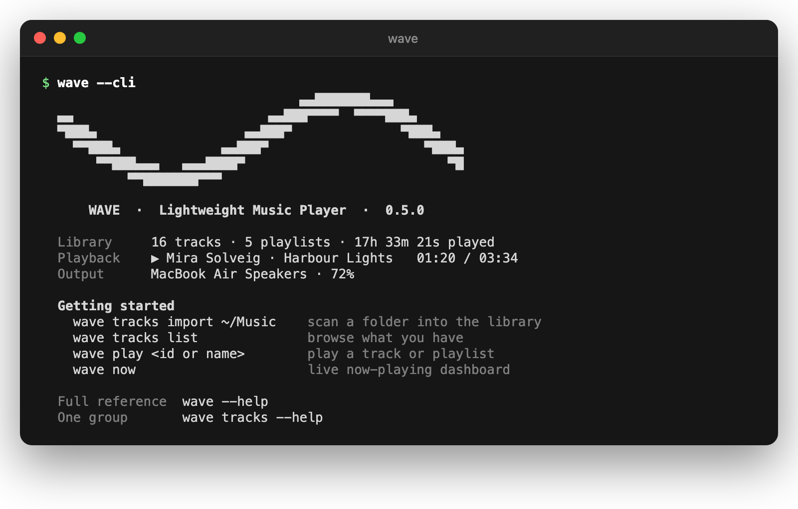

---

## Android

Android is a first-class target, not a resized desktop build. The Rust core still
owns the library and the queue, but decoding and output go through **Media3
ExoPlayer** over JNI so `content://` URIs from the Storage Access Framework play
directly — no copying your music into app storage.

- Touch layout with a drawer, a bottom mini-player, and a full **Now Playing**
  sheet you can drag to dismiss.
- When a song has synced lyrics, tap the cover to read along, or keep watching
  the cover and Now Playing turns to the lyrics as the first verse starts.
- **Glass effect** and **Animations** switches in Settings swap the blurred
  panels for solid ones and make every transition instant, for slower phones.
- **SAF folder picker** and scanning — grant a folder once, keep your files where
  they are.
- **Media session** bridge: notification controls, lock screen, Bluetooth, and
  Android Auto-style transport events.
- Android back button is trapped so it closes panels and sheets before leaving.
- Built for `arm64-v8a` and `armeabi-v7a`, `minSdkVersion 24`.

<div align="center">

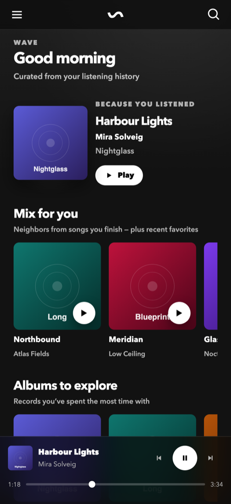
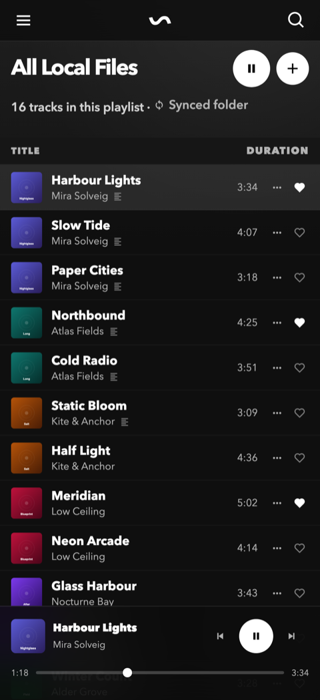
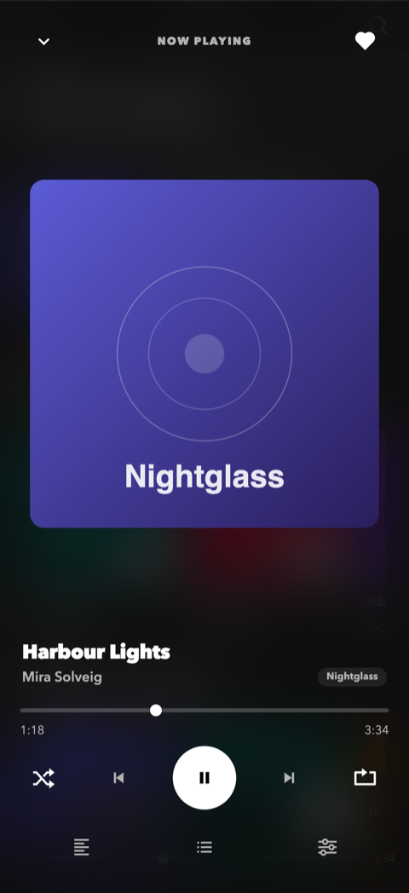

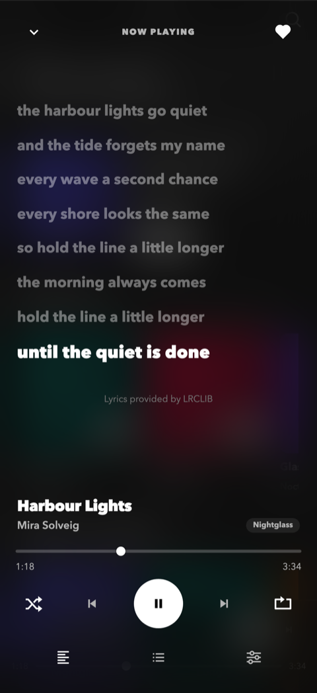
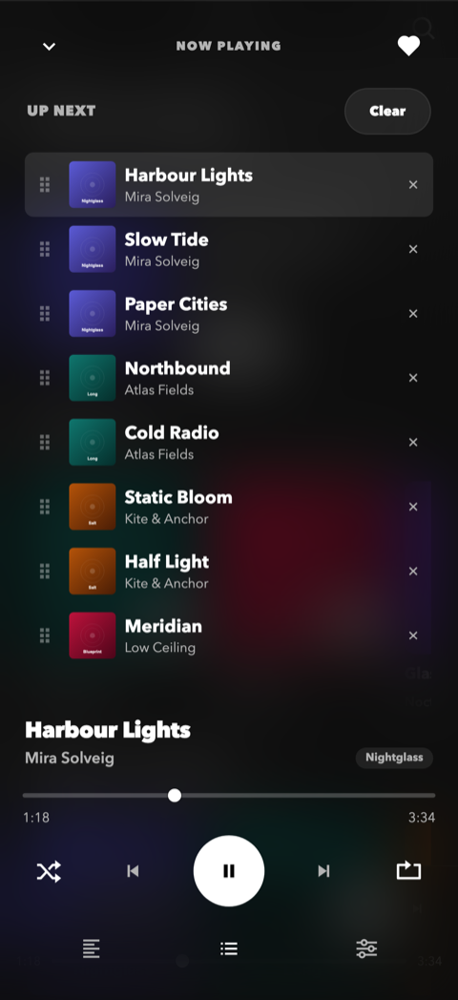
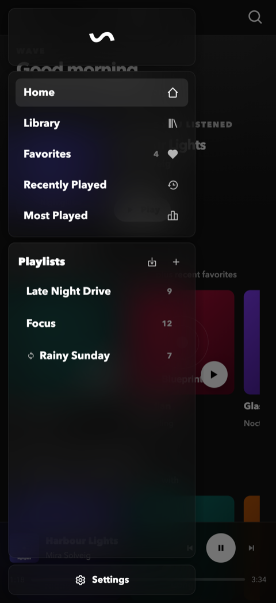

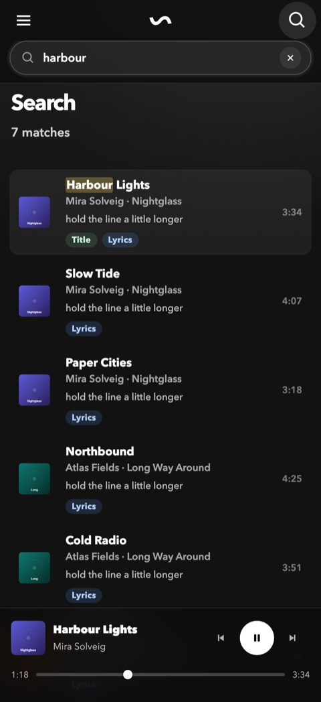
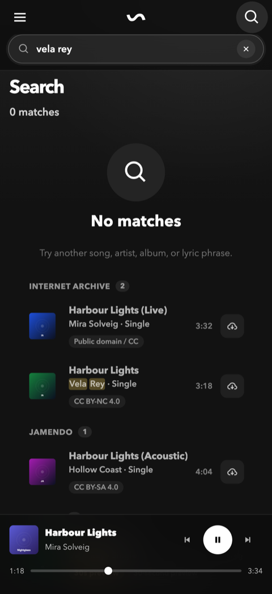
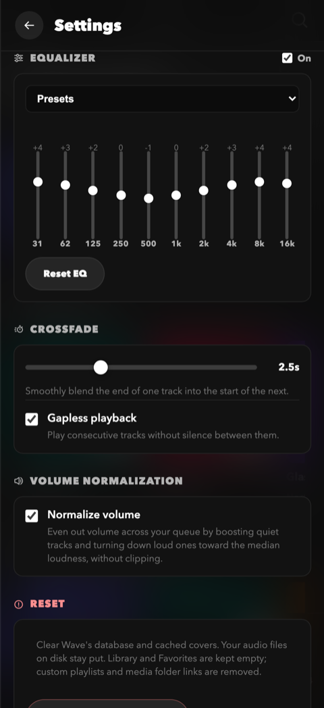

</div>

Details: [`docs/backend/android.md`](docs/backend/android.md).

---

## Command line interface

`wave` with arguments runs as a command-line tool instead of opening the
window. Every feature of the app is there, and it works well both for people at
a terminal and for programs driving it.

```bash
wave --cli        # the landing screen: library summary, what's playing, first steps
wave --help       # every command
wave tracks --help
```

Library commands work any time, even while the app is open. Playback runs in a
small background service, started by the first playback command, with its own
tray or menu-bar icon (play/pause, next, previous, playlists). While the
desktop app is open, it owns playback and the CLI's playback commands step
aside.

Anywhere a command wants a **track**, you can give its full id, the first few
characters of the id (`3f2a91c4`, any prefix that matches only one track), or
the path to the audio file. A **playlist** can be given by name (any case, or
just the start of it when that is unique) or by id.

### Library

```bash
wave tracks import ~/Music            # scan folders or files into the library
wave tracks import a.flac b.mp3       # several at once
wave tracks list                      # everything, sized to your terminal
wave tracks list "Late Night Drive"   # one playlist's tracks
wave tracks query solveig             # search title, artist and album
wave tracks info 4a72a8cc             # every detail of one track
wave tracks remove 4a72a8cc           # drop it from the library (the file stays)
```

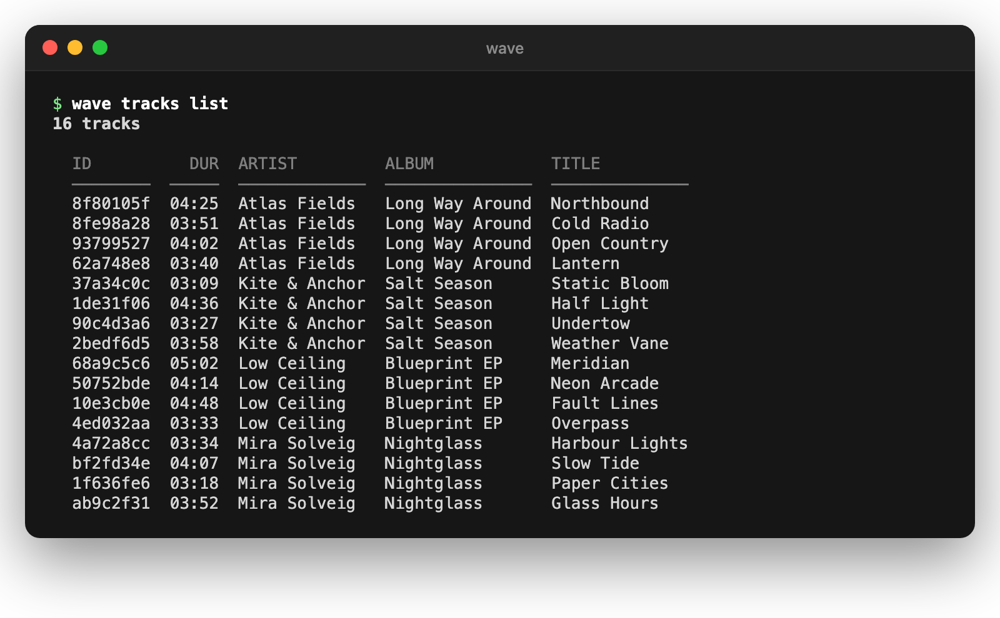

An import reports how many tracks were new and lists anything it skipped, with
the reason, such as an unreadable file or a second copy of a song already in
the library.

### Playlists and favorites

```bash
wave playlists list
wave playlists create "Road Trip"
wave playlists add-track "Road Trip" 68a9c5c6
wave playlists remove-track "Road Trip" 68a9c5c6
wave playlists info "Road Trip"
wave playlists rename "Road Trip" "Long Drive"
wave playlists export "Long Drive" drive.m3u    # .m3u, .m3u8 or .json
wave playlists import ~/Downloads/mix.m3u       # paths may be relative to the file
wave playlists sync "Rainy Sunday"              # re-scan a folder-linked playlist
wave playlists delete "Long Drive"

wave favorite add 4a72a8cc
wave favorite list
```

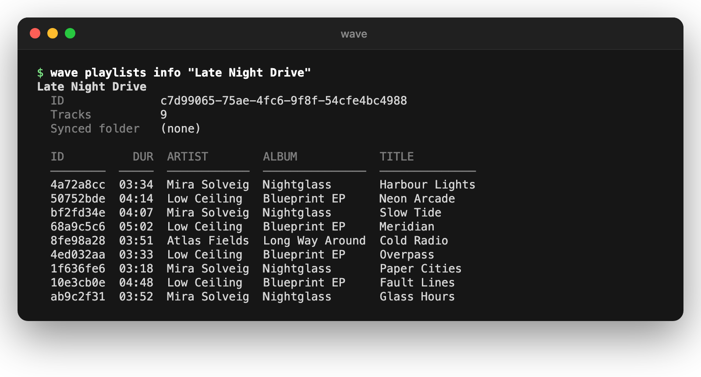

### Playback

```bash
wave play "Late Night Drive"     # a playlist, by name or id...
wave play 4a72a8cc               # ...or a single track
wave playback pause              # also: resume, stop, next, previous
wave playback seek 1:30          # or 90, or a step: +10, -15
wave playback sleep 30           # pause in 30 minutes; also 1h30m, end, off
wave playback speed 1.25         # 0.5 to 2; also 125%, or a step: +0.25
wave queue add 68a9c5c6          # to the end of the queue
wave queue next 68a9c5c6         # straight after the current track
wave queue list
wave queue remove 3              # positions as queue list shows them
wave queue shuffle on            # omit on/off to toggle
wave queue repeat all            # off, one or all
wave devices list
wave devices switch "External Headphones"
wave devices volume 60%          # or 0.6, or a step: +10, -10
wave playback shutdown           # stop the background service
```

`wave now` is a live dashboard of what's playing: the track, a progress bar,
volume, output device, shuffle and repeat, the sleep timer when one is set,
and the next two tracks. It redraws in place until you press Ctrl-C, and
`wave now --once` prints a single frame.

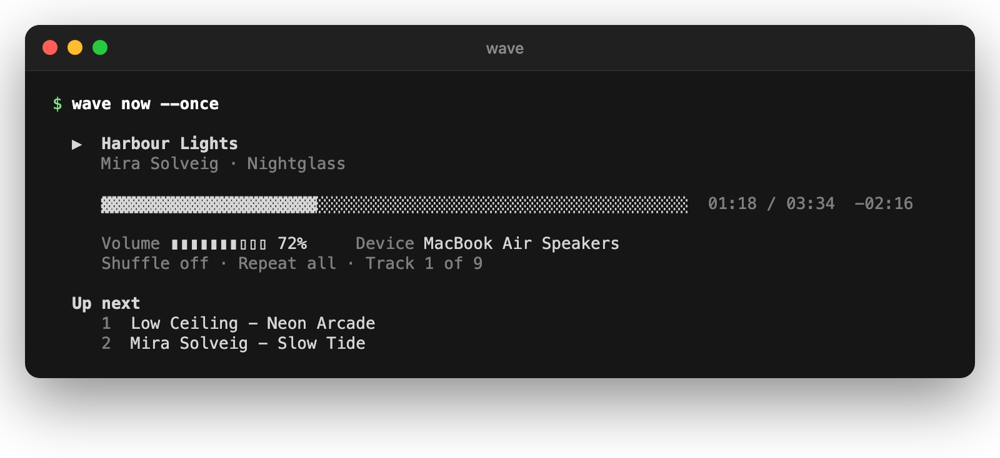

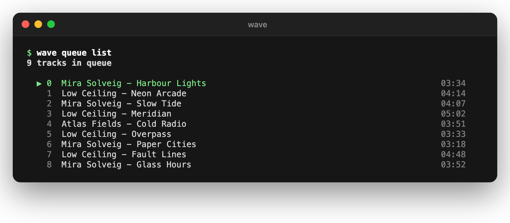

### Tags and cover art

```bash
wave metadata get 4a72a8cc
wave metadata set 4a72a8cc --title "Harbour Lights" --year 2023 --genre "Dream Pop"
wave metadata set 4a72a8cc --genre ""          # an empty value clears the tag
wave metadata cover-set 4a72a8cc cover.jpg     # into the file and the library
wave metadata cover-export 4a72a8cc cover.jpg  # the full-size embedded cover
```

Tags are written into the audio file itself, so other players see them too,
and the library is updated to match. The fields are `--title`, `--artist`,
`--album`, `--album-artist`, `--genre`, `--year`, `--track-number` and
`--disc-number`.

### Equalizer and playback settings

```bash
wave dsp eq-show                 # the current curve, drawn
wave dsp presets                 # flat, bass-boost, rock, jazz, vocal, ...
wave dsp preset rock
wave dsp eq-band 1k +3           # one band, by number (1-10) or frequency
wave dsp eq-set 3 2 0 -1 -1 0 1 2 3 2   # all ten bands, 31 Hz to 16 kHz
wave dsp bass +4                 # or treble: a dial that reshapes the curve
wave dsp eq-disable              # also: eq-enable, eq-reset
wave dsp crossfade 3             # seconds, 0 to 8; 0 turns it off
wave dsp gapless on
wave dsp export my-eq.json       # and wave dsp import my-eq.json
```

Gains run from -12 to +12 dB. With playback running, changes are heard at
once; otherwise they are saved for the next time Wave plays.

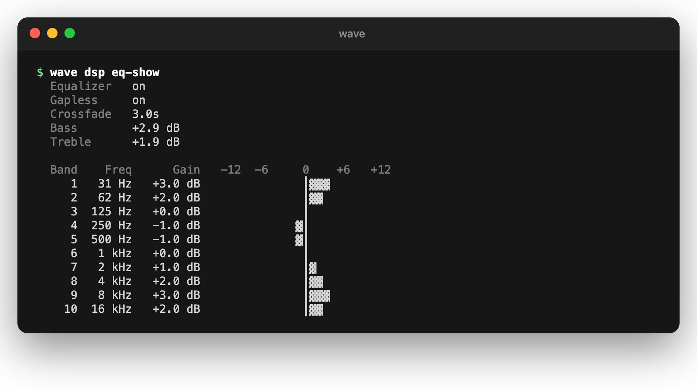

### Stats

```bash
wave stats summary               # totals and the top tracks, artists, albums, genres
wave stats recent                # recently played
wave stats most                  # most played, by listening time
wave stats artists --limit 10    # also: albums, genres
```

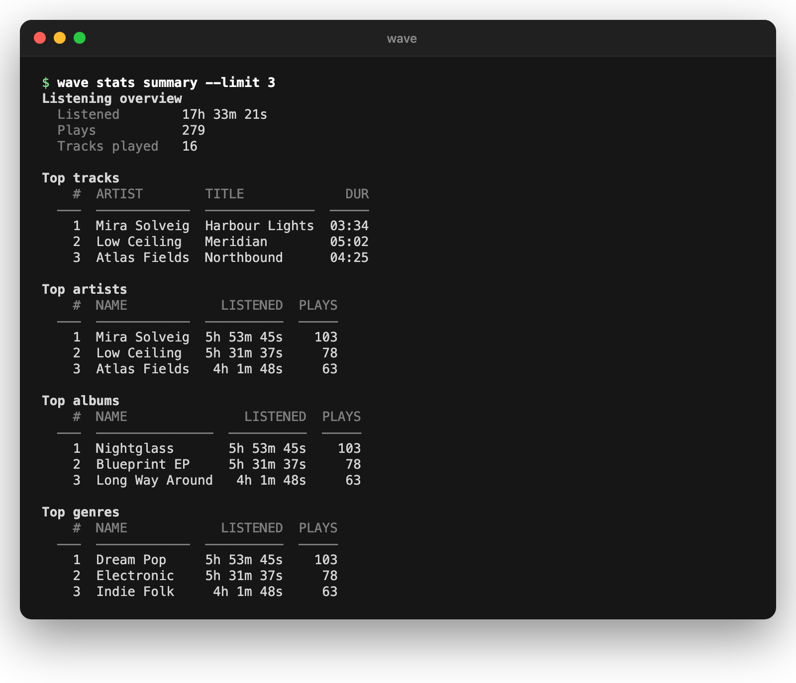

### Terminal output

Output fits the terminal it lands in. Tables size their columns to the window
and stack rather than wrap when it is narrow. Colour is dropped when output
goes to a pipe or a file, or when `NO_COLOR` is set; `--color always|never`
overrides both. Block characters fall back to ASCII on consoles that cannot
draw them, or when `WAVE_ASCII` is set. Progress from a long import goes to
stderr, so `wave tracks import ~/Music > log.txt` keeps the file clean.

Shell completions are built in:

```bash
wave completions zsh > ~/.zfunc/_wave     # also bash, fish, elvish, powershell
```

### Scripting and automation

Add `--json` to any command and the output becomes a stable contract that
other programs can rely on: JSON on stdout when the command succeeds, a JSON
error on stderr when it fails, and nothing else on either. Every documented
shape carries a schema version, so a program can tell what it is talking to.

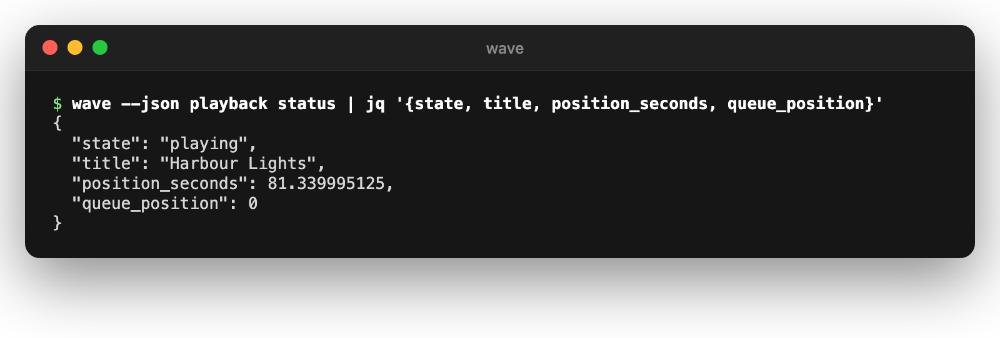

Failures exit with a status and a matching `kind`, so callers can branch
without reading messages:

| Exit status | `kind` | Meaning |
|---|---|---|
| 0 | | Success |
| 1 | `general` | Something went wrong, such as an unreadable file |
| 2 | `usage` | A wrong command, flag, or value, such as `dsp bass 30` |
| 3 | `not_found` | No such track, playlist, file or cover |
| 4 | `no_daemon` | Playback is not running |
| 5 | `conflict` | A name already taken, a protected playlist, or the app owning playback |

```bash
$ wave --json playlists rename Nope Other
{"code":3,"error":"Playlist not found: Nope","kind":"not_found","ok":false}
```

**Follow playback** as it happens, instead of polling: `wave now --json
--watch` writes one JSON line per change (track, state, volume, queue, a seek)
until playback stops.

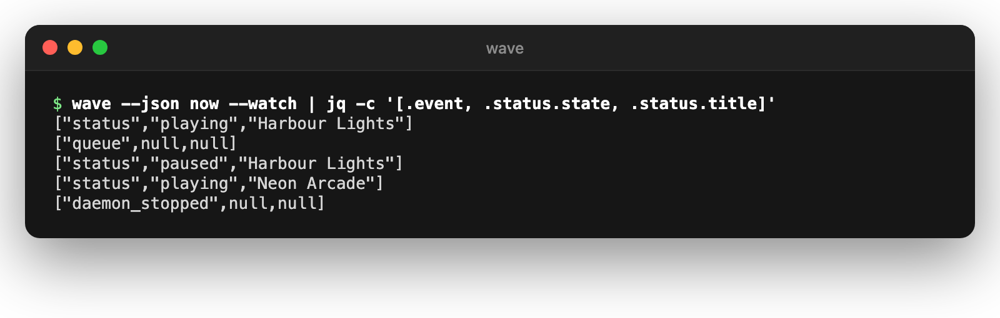

**Send many requests at once** with `wave batch`, which reads them from stdin,
runs them in order, and answers each on its own line. A request can be a
command line, a JSON array of arguments, or a JSON object with an `id` that
comes back in its answer. One failed request does not stop the rest.

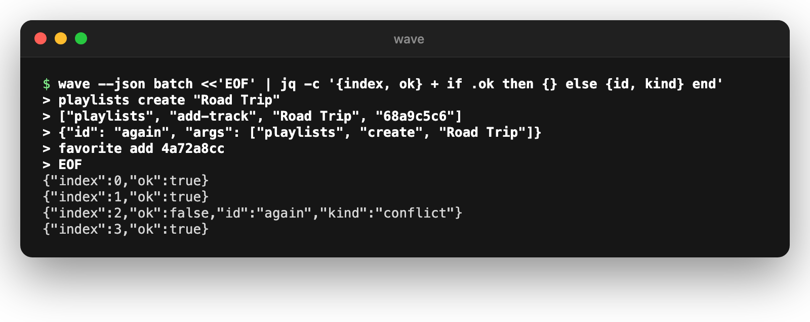

**Pass many tracks** to any command that takes one by putting `-` in its place
and listing them on stdin, one per line, NUL-separated, or as a JSON array:

```bash
find ~/Music/Jazz -name '*.flac' | wave favorite add -
wave --json tracks query solveig | jq -r '.[].id' | wave queue next -
printf '%s\n' a.flac b.flac | wave playlists add-track "Road Trip" -
```

The full contract, with every JSON shape, every event, and the batch format, is
in [`docs/cli.md`](docs/cli.md).

---

## Tech stack

### Frontend
- **React** + **TypeScript** + **Vite**

### App shell
- **Tauri 2** (lightweight native shell)

### Backend / audio engine
- **Rust**
- **Rodio** + **Symphonia** + **CPAL** — desktop playback
- **Lofty** — writing edited tags back to files
- **Media3 ExoPlayer** (JNI) — Android playback (`content://` / SAF-friendly)

### Storage
- **SQLite** — music library, playlists, listening history, settings

### External services (all optional)
- **LRCLIB** — lyrics
- **MusicBrainz** + **Cover Art Archive** — metadata and cover art enrichment
- **Internet Archive**, **Jamendo**, **Deezer** — remote search tier

---

## Project structure

```text
Wave/
├── src/                         # React + TypeScript frontend
│   ├── components/             # UI building blocks (incl. dialogs/)
│   ├── hooks/                  # Frontend behavior hooks
│   ├── utils/                  # Shared helpers
│   │   └── player.ts           # Typed wrapper around Tauri backend commands
│   └── App.tsx                 # Application shell and view routing
├── src-tauri/                  # Rust/Tauri backend
│   ├── Cargo.toml
│   ├── tauri.conf.json
│   ├── android-src/            # Java sources copied into gen/android by CI
│   └── src/
│       ├── app/                # App paths, settings, single-instance runtime logic
│       ├── android/            # Android JNI: ExoPlayer, SAF, media bridge
│       ├── audio/              # Playback engine, DSP, loudness normalization
│       ├── integrations/       # Tray and OS media-control integration
│       ├── os_media/           # Windows-specific media integration
│       ├── sources/            # Remote song sourcing: providers, cache, downloads
│       ├── cli/                # Headless CLI: parsing, rendering, one module per command group
│       ├── commands.rs         # Tauri invoke command handlers
│       ├── cover_art.rs        # Cover art extraction and caching
│       ├── dto.rs              # Shared DTOs between backend and frontend
│       ├── enrichment.rs       # MusicBrainz / Cover Art Archive / LRCLIB lookups
│       ├── error.rs            # Backend error definitions
│       ├── library.rs          # SQLite-backed library and playlist logic
│       ├── listen.rs           # Play history and listening statistics
│       ├── metadata.rs         # Track metadata extraction
│       ├── path_validation.rs  # Safe path validation helpers
│       ├── playback_daemon.rs  # Background playback daemon and IPC
│       ├── tag_edit.rs         # Writing edited tags back to audio files
│       ├── lib.rs              # Tauri backend composition root
│       └── main.rs             # Native process entry point
├── docs/
│   ├── backend/                # Backend API and architecture documentation
│   └── screenshots/            # Images used by this README
└── README.md
```

### Backend layout notes

- The backend lives in `src-tauri/`; `tauri.conf.json` is inside that directory, not at the repository root.
- `src-tauri/src/lib.rs` is the GUI/backend composition root where state and Tauri commands are registered.
- `src-tauri/src/main.rs` selects between GUI mode, CLI mode, and the playback daemon at startup.
- `src/utils/player.ts` is the frontend-facing wrapper around the backend command surface.
- Detailed backend API docs live in [`docs/backend/README.md`](docs/backend/README.md).
- Android ExoPlayer + SAF details: [`docs/backend/android.md`](docs/backend/android.md).
- Remote sourcing (providers, streaming cache, downloads): [`docs/backend/sources.md`](docs/backend/sources.md).
- Equalizer and filter math: [`docs/backend/dsp.md`](docs/backend/dsp.md).

---

## Getting started

### Prerequisites

- **Node.js** (LTS)
- **Rust** and **Cargo**
- **Git**

Verify:

```bash
node -v && rustc --version && cargo --version
```

### Install dependencies

```bash
npm install
```

### Run in development

```bash
npm run tauri dev
```

This starts the frontend and the native backend together. Opening the plain Vite
URL in a browser will not work — the UI needs the Tauri backend behind it.

### Build for production

```bash
npm run tauri build
```

This produces the installers for your platform — `.deb`, `.rpm` and AppImage on
Linux, an NSIS installer on Windows, `.app` and `.dmg` on macOS — under
`src-tauri/target/release/bundle/`.

Packaging inputs (desktop entry, installer hooks, distro manifests) live in
[`packaging/`](packaging); see [docs/INSTALL.md](docs/INSTALL.md).

### Android

```bash
npm run android:init     # once, to generate the Gradle project
npm run android:dev      # run on a connected device or emulator
npm run android:build    # produce an APK / AAB
```

Requires the Android SDK + NDK and the `aarch64-linux-android` /
`armv7-linux-androideabi` Rust targets.

### Optional: remote sources

Wave works fully offline. Searching the internet for music is opt-in — toggle
**Search outside sources** in Settings.

Deezer and Internet Archive need no setup. Jamendo needs a free client ID from
[developer.jamendo.com](https://developer.jamendo.com), entered in Settings.

Deezer's API only serves 30-second previews; previews play but are never saved to
your library. Full-length audio comes from Internet Archive and Jamendo.

---

## Design goals

- **Fast startup**
- **Low memory usage**
- **Clean architecture**
- **No unnecessary dependencies**
- **Long-term maintainability**

---

## License

Licensed under the **GNU Affero General Public License v3.0 (AGPL-3.0)**, with additional terms permitted under AGPLv3 Section 7. See [LICENSE](LICENSE).

This means: you're free to use, study, modify, and redistribute this code, including running it as a network service — but any modified version (or service built on one) must also be released as source under AGPL-3.0, must keep author attribution intact, and must be clearly marked as a different, unaffiliated project (see the Trademark Notice below and the additional terms in [LICENSE](LICENSE)).

### Trademark Notice

"Wave," the Wave name, and its logo/branding are **not** licensed under AGPL-3.0 and are not covered by the code license above. They are trademarks/branding of the original author. The AGPL-3.0 license grants rights to the *source code* — it does not grant permission to use the "Wave" name, logo, or branding for a fork, modified version, or derivative service.

If you fork or modify this project, please:
- Use a different name and logo that isn't confusingly similar to "Wave"
- Clearly state that your version is unaffiliated with and not endorsed by the original project

## Author

Built with ❤️ by **Behdad**
